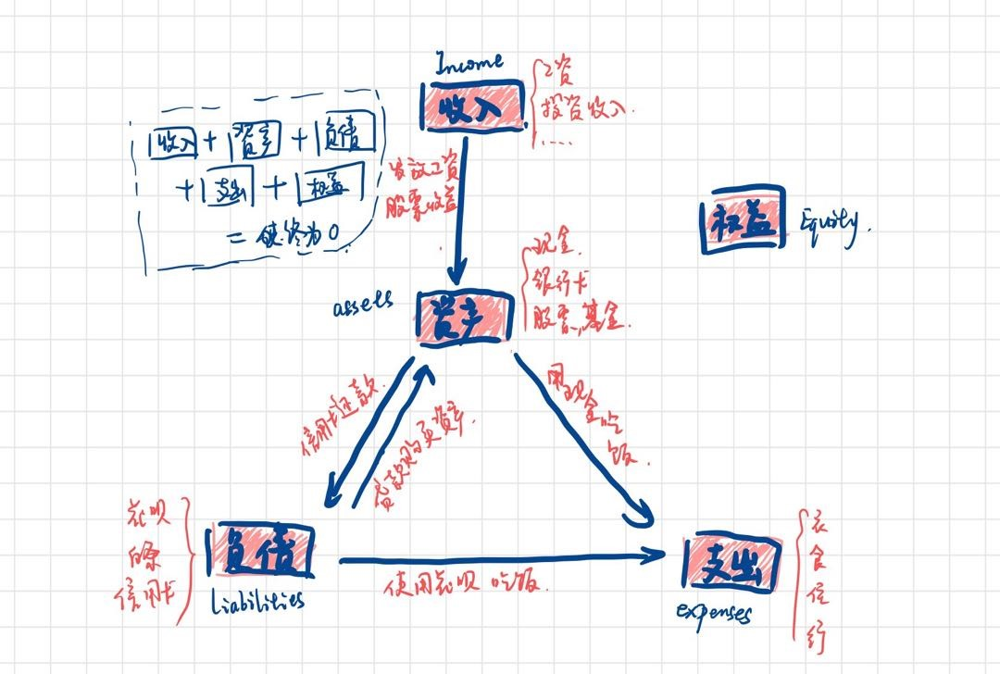

复式簿记系统中，一般有五个大桶，每个桶里又可以放很多个小桶，这五个大桶分别是：

- 资产 Assets: 现金、银行存款、有价证券等；
- 负债 Liabilities: 信用卡、房贷、车贷等；
- 收入 Income: 工资、奖金等；
- 费用 Expenses: 外出就餐、购物、旅行等；
- 权益 Equity: 用于「存放」某个时间段开始前已有的豆子

解释

- 把收入（Income）想像成一个装着你一生（过去和未来）所有劳动成果的桶，每次你的收入都是从桶里取出东西（通常以货币的形式）所以**收入桶的数字通常是负数**。
- 把费用（Expenses）想像成一个装着你一生（过去和未来）所有消费的桶，每次你的支出都是往桶里放东西（以货币的形式表现）所以**费用桶的数字通常是正数**。
- 权益 Equity，负数，净资产，存放在记账开始前已经有的权益。
  等下，Equity 是怎么来的？仔细想想小明的例子，他的四个桶要满足这个等式，前提是桶里都是空的。但是小明不是一个刚出生的婴儿，他已经活了二十多年了，之前的 Income、Liabilities、Assets、Expenses 怎么算呢？答案就是放到 Equity 里。当小明决定开始用复式簿记的时候，他从 Equity 里倒一些豆子其他桶里（或从其他桶倒一些豆子到 Equity 里），将其他桶的数字调节成符合当前实际情况即可。实际操作中，人们一般只关心 Income 和 Expenses 桶的数字在某段时间内的变化，并不关心它的总数（除非你想统计你出生到现在一共收入多少、支出多少），只要把 Assets 和 Liabilities 调节准就行了。这便是 Equity 的作用——存放已有的「权益」。

更一般地，Equity 可以用来存放所选取的时间范围之前的「汇总」。比如小明从 2012 年开始用 Beancount，一直用到 2016 年，他想只看 2016 年的财务状况，那 Beancount 便会把他 2016 之前四年的数据「调节」到 Equity 里，来维持 2016 年会计恒等式的平衡。

**每笔交易在不同账户的数字加起来和为 0 是复式记账的重要特性和原则，也是用来检验账目正确性的重要依据。**

- 有基础的会计知识，至少听说过「[会计恒等式](https://zh.wikipedia.org/?curid=1435109)」
  (Income + Liabilities) + (Assets + Expenses) + Equity = 0

与传统的复式簿记不同，Beancount 及其前辈们用的复式簿记方法使用了正负号而不是拗口的「借」（debit）和「贷」（credit）来表示五个桶之间的豆子变动，更加容易理解和思考，也不容易出错。

- [Beancount -- Language Syntax](https://docs.google.com/document/d/1wAMVrKIA2qtRGmoVDSUBJGmYZSygUaR0uOMW1GV3YE0/)
- [Beancount -- Getting Started](https://docs.google.com/document/d/1P5At-z1sP8rgwYLHso5sEy3u4rMnIUDDgob9Y_BYuWE/)
- [Beancount -- Syntax Cheat Sheet](https://docs.google.com/document/d/1M4GwF6BkcXyVVvj4yXBJMX7YFXpxlxo95W6CpU3uWVc/)


图中显示，我们的每次财务行为，都被抽象为钱在这四个「桶」之间流转。如图中所示一样，我们的钱全部来源于「收入」和「负债」，最终流向「资产」和「消费」，总体上始终满足：

❯ bean-example
❯ bean-query 1.bean 'balances'

```
比如 Balance 记录，表示一条断言，即某一天某个账户上的某个通货的资产应当等于某个数值。比如：
2020-08-30 balance Assets:Stock 1.00 GOOG
非常简单的一句话，当 Beancount 发现资产不能对上的时候，就会报出错误，我常常在信用卡的账单日，和一个月结束的时候，通过这一条语句来完成对账操作。

2020-08-29 * "购入1股谷歌-C"
    Assets:Bank:MatsuBank -1600.00 USD
    Assets:Stock              1.00 GOOG { 1600.00 USD }
2020-08-30 * "卖出1股谷歌-C"
    Assets:Bank:MatsuBank  1650.00 USD
    Assets:Stock             -1.00 GOOG { 1600.00 USD } @@ 1650.00 USD
    Income:Invesrment       -50.00 USD
表示你以 1650.00 美金卖出了 1 股以 1600.00 买入的谷歌C股票，并获得了 50 美金的收益。在实际操作中，常常会在不同价格零散买入股票、基金，并在某个时间点一口气卖出一定数量的资产。Beancount 支持自动选择一个通货的标签，一般情况下，我用的是**「先进先出」**的策略，这需要在定义账户的时候写明：

在实际操作中，常常会在不同价格零散买入股票、基金，并在某个时间点一口气卖出一定数量的资产。Beancount 支持自动选择一个通货的标签，一般情况下，我用的是**「先进先出」**的策略，这需要在定义账户的时候写明：
1970-01-01 open Assets:Stock "FIFO"

```

```账户设计
;beancount 账户是树形结构的，不支持中文名，在命名的时候可以采用银行的缩写及尾号、法人姓名、用途等等。
;功能：设置属性
;语法：option 属性名 值
option "title" "我的账本"
option "operating_currency" "CNY"


; 银行存款
1970-01-01 open Assets:Bank
; 各类基金及股票
1970-01-01 open Assets:Investment:Fund:R5 "FIFO"
1970-01-01 open Assets:Investment:Fund:R4 "FIFO"
1970-01-01 open Assets:Investment:Fund:R3 "FIFO"
1970-01-01 open Assets:Investment:Fund:R2 "FIFO"
1970-01-01 open Assets:Investment:Stock "FIFO"

; 信用卡
1970-01-01 open Liabilities:CreditCards
; 个人借款
1970-01-01 open Liabilities:Personal

; 工资
1970-01-01 open Income:Salary
; 股权激励
1970-01-01 open Income:RSU
; 奇怪的收入
1970-01-01 open Income:Windfall

; 分红和切割
1970-01-01 open Income:Investment:Fund:R5:Dividend
; 盈亏
1970-01-01 open Income:Investment:Fund:R5:PnL
1970-01-01 open Income:Investment:Fund:R3:Dividend
1970-01-01 open Income:Investment:Fund:R3:PnL


Assets：资产
资产账户主要用来记录你想追踪的资产。换句话说，如果你做了什么变动这个资产的事，你就希望记下这笔账，那就说明它应该开个户了，比如支付宝、银行卡。反之，对于手机话费、校园卡、村口老王的洗剪吹优惠卡、交通卡，我个人认为就没什么开户的必要了。我可懒得每次坐公交都记一笔帐，对我而言，充卡的时候记一笔就得了。把记账搞得太复杂，只会让你最终放弃记账。据此可以提供一条判断准则：只给能取出/变成钱的账户开资产账户。

我给资产账户定的格式是：Assets:类别:账户[:币种]。类别我大致取了以下几种：

Cash：现金
Digital：数字钱包。支付宝、微信
DebitCard：储蓄卡
FinTech：数字理财产品。余额宝、零钱通
Tangibles：有形资产。实体类资产，如游戏卡带
Receivables：代付记账。帮其他人垫付钱就相当于你的资产，账户就是垫付对象，建议用人名的首字母拼音
Trade:Fund：基金。账户是F{基金号}
Trade:Stock：股票
Liabilities：负债
负债的格式和资产一样。

CreditCard：信用卡。建议账户用卡种:银行，比如Liabilities:CreditCard:MASTER:ICBC
Loan：贷款
ConsumptionCredit：消费信贷。如花呗、白条
FinalPayment：尾款
Payable：借钱、他人垫付
Income：收入
同样格式不变，介绍几种我自己选的类别：

Job：工作相关收入。如薪水、医保等等
PartTime：零工收入。如外包
Gift：意外所得、获赠
Home：生活费
Award：奖金
Interest：利息。银行卡、余额宝
Trade：交易PnL。如网店、基金、股票
2ndTrade：二手交易PnL。如闲鱼
关于交易相关的内容，我会在第二篇里面详细讲解。一般而言只需要建立PnL（盈利或亏损，Profit and loss）账户就行，这也是收入账户里少有的几个可能是正的账户（虽然我们希望他是负的，但基金有它自己的想法）。

Expenses：支出
跟个人习惯强相关。一般而言覆盖“衣食住行”就行啦，关键还是：你希望知道自己在哪些上的开销有多少，就建哪些账户。建议先随便写几个，然后在之后的记账中慢慢补全。还可以把自己上个月的账单整理出来，然后分析自己可能常用的账户。

Equity：权益
这个没有什么必要规划，就这一个即可。其它账户要么Beancount会帮你创建，要么下一篇会介绍。

Opening-Balances：开始记账记录初始金额用

```

```例子1
* 指定账单使用的货币单位
option "operating_currency" "CNY"

* 开启具有的账户：2020-04-16 指开启时间，之后关于这个账户的资金变动时间不能早于 2020-04-16，否则 beancount 会报错
* CNY 指 货币单位，元
* 工商银行1234
2020-04-16 open Assets:ICBC1234 CNY
* 现金
2020-04-16 open Assets:Cash CNY
* 股票
2020-04-16 open Assets:Stock CNY
* 花呗
2020-04-16 open Liabilities:Huabei CNY
* 可乐消费
2020-04-16 open Expenses:Cola CNY

* 这个账户一般用于初始账户的收支平衡
2020-04-16 open Equity:Opening-Balances CNY

* 初始化已有资产和负债
* 先用 Equity:Opening-Balances 平衡没有数据来源的 Assets:ICBC1234 账户，并且设为 10000 元
2020-04-16 pad Assets:ICBC1234 Equity:Opening-Balances
2020-04-17 balance Assets:ICBC1234     10000.00 CNY

* 同样的方式初始化其他账户
2020-04-16 pad Assets:Cash Equity:Opening-Balances
2020-04-17 balance Assets:Cash          2000.00 CNY
2020-04-16 pad Assets:Stock Equity:Opening-Balances
2020-04-17 balance Assets:Stock         5000.00 CNY

* 债务一般负数表示
2020-04-16 pad Liabilities:Huabei Equity:Opening-Balances
2020-04-17 balance Liabilities:Huabei  -1200.00 CNY

* 然后从 2020-04-17 开始记录自己的收入和支出
* 下班用现金买罐可乐
2020-04-17 * "买罐可乐"
  Assets:Cash                             -3.00 CNY
  Expenses:Cola                            3.00 CNY
```

这里需要注意的是，2020-04-17 balance Assets:ICBC1234 10000.00 CNY 这条语句（包括下面几条同语法的语句）中的 balance 一般表示所记录日期当天的最开始时间 2020-04-17 00:00，所以这里记录了截止 2020-04-16 23:59 的资产，而从 2020-04-17 开始记录后续的资金流水。

```账户语法
;开通账户：
;时间 open 账户名
1970-07-01 open Assets:Cards:BOC:1234

;注销账户：
;时间 close 账户名
1999-07-01 close Assets:Cards:BOC:1234

```

```投资
;语法：时间 [对账标志位] 收款人 备注
;        账户A 数量 通货名称{成本价} @现价 或者 @@总价
;        账户B 变动情况
;        账户C 变动情况
2020-07-22 * "A股" "33.29 元加仓 400 股中银证券"
    Assets:Bond:AMS:Cash -13316.00 CNY
    Assets:Bond:AMS:Positions 400.00 A_601696 {} @33.29 CNY
    Expenses:AMS 5.00 CNY
    Assets:Bond:AMS:Cash -5.00 CNY

```

```标签
;语法：pushtag #标签内容
;       交易记录1
;       交易记录2
;       .........
;      poptag #标签内容

pushtag #2019-07-Europe-Trip

2019-06-01 * "奥地利航空" "东京-维也纳"
    Expenses:Transport:Airline 600 USD
    Liabilities:US:CreditCard:Citi

...

poptag #2019-07-Europe-Trip

```

```通货
;功能：导入某个通货某日的价格
;语法：时间 price 通货 价格
2020-08-01 price GOLD 420.00 CNY

```

```项目结构
.
├── account                            // 账目类型定义文件
│   ├── assets.beancount
│   ├── equity.beancount
│   ├── expence.beancount
│   ├── income.beancount
│   ├── liability.beancount
│   └── balance.beancount
│
├── billflow                           // 按年份记录的交易数据
│   ├── 2015                           // 年度按月份记录的交易数据
│   │   ├── 2015.beancount
│   │   ├── 201501.beancount
│   │   ├── 201502.beancount
│   │   ├── ...
│   │   ├── 201511.beancount
│   │   ├── 201512.beancount
│   │   ├── 2015shopping.beancount     // 年度特殊类型的交易数据
│   │   ├── 2015income.beancount
│   │   ├── 2015transfer.beancount
│   │   └── ...
│   │
│   ├── 2016
│   │   ├── *.beancount
│   │   └── ...
│   │
│   ├── ...
│   │   ├── *.beancount
│   │   └── ...
│   │
│   ├── 2022
│   │   ├── *.beancount
│   │   └── ...
│   │
│   ├── 2023
│   │   ├── *.beancount
│   │   └── ...
│   │
│   └── other
│       ├── *.beancount
│       └── ...
│
├── main.beancount            // 主文件，包含所有的交易数据

```

定期为所有资产账户添加断言，如果断言的数值与 beancount 里计算的数值不一致的话，beancount 就会抛出错误。

## 大额转账的处理

对于一个大额的转账类收入或支出，如果直接归入收入或支出，会导致统计图的比例被挤压。

我的方案是：创建一个 Equity:Exchange 账户负责转账记录，然后在 事件 中创建 转账 条目用以记录。如下：

```
2020-05-12 * "爸爸转账5万元"
Assets:BankCard 50000.00 CNY
Equity:Exchange -50000.00 CNY

2020-05-12 event "转账" "爸爸转账5万元"

```

比如资产中的银行存款有大量的钱，我全额买车了，如果将车作为自己的资产，这样的账应该怎么考虑呢？

把车作为资产的话，可以使用一个独立的 commodity（通货），比如：

```
2019-01-01 * "DMC DeLorean"
Assets:Bank
Equity:Cars      1 DELOREAN {30000.00 USD}

```

https://fava.pythonanywhere.com/
